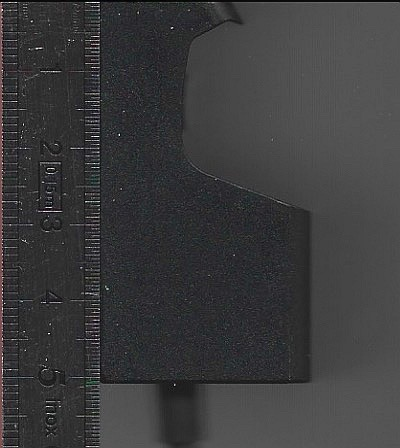

# Steam Deck leaning stand with EU plug slot

A 3D-printable stand for the Steam Deck, sized to match the support that comes with the original console carrying case, with a built-in recess for the EU power adapter (wall plug).

Designed in [FreeCAD](https://www.freecad.org/) (1.1).

*The original Steam Deck support, scanned next to a ruler. It was used as the reference for the outline and size of this stand.*

## Files

| What | Path |
| --- | --- |
| FreeCAD source model | [`cad/steamdeck-stand-leaner-eu-plug.FCStd`](cad/steamdeck-stand-leaner-eu-plug.FCStd) |
| Reference photo of the original support | [`pics/original-steam-deck-support.jpg`](pics/original-steam-deck-support.jpg) |
| Print-ready mesh (3MF, millimetres) | [`exports/steamdeck-stand-leaner-eu-plug-Support.3mf`](exports/steamdeck-stand-leaner-eu-plug-Support.3mf) |

## Dimensions

Overall size of the exported part: **180 × 70 × 35.83 mm** (X × Y × Z).

## Printing

Import the 3MF into your slicer. The part sits flat on the build plate at Z = 0. Print settings are up to you.

## Editing the model

Open `cad/steamdeck-stand-leaner-eu-plug.FCStd` in FreeCAD. The final part is the `Support` group, built from:

- `RawSupport`: the stand body.
- `steamdeck-eu-plug001`: the shape of the EU plug adapter.
- `Cut`: the stand body minus the plug adapter, which gives the plug recess.

To re-export, select the `Support` group and use *File → Export…* as 3MF.
