# FreeCAD Steam Deck Stand Leaner (EU Plug)

Personal project to design a 3D-printable Steam Deck stand in FreeCAD: a
charger cradle that stores the EU power adapter and its cable inside, props
the Deck up, and slides into the strap on the official carrying case in place
of the original support.

This is a remake of
[Steamdeck USB-C Charger Cradle with built in stand (USA Plug)](https://www.printables.com/model/170877-steamdeck-usb-c-charger-cradle-with-built-in-stand)
by Neebick on Printables, redrawn from scratch in FreeCAD (1.1) for the EU
plug.

## Project structure

```
cad/                     # FreeCAD source file (.FCStd)

exports/                 # 3MF export for slicing and printing
└── steamdeck-stand-leaner-eu-plug-Support.3mf

images/                  # reference photo, renders, slicer screenshot and print photos
```

## Design

The stand is a rounded, open tray, sized from the support that ships with
the original Steam Deck carrying case (photographed next to a ruler as a
reference) so that it fits the case strap the same way.

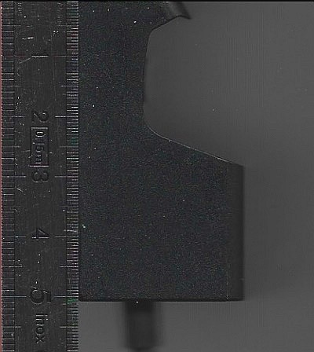

Inside, a recess shaped like the EU power adapter holds the charger in
place, with room left along the tray for the coiled USB-C cable.

| | |
|---|---|
| 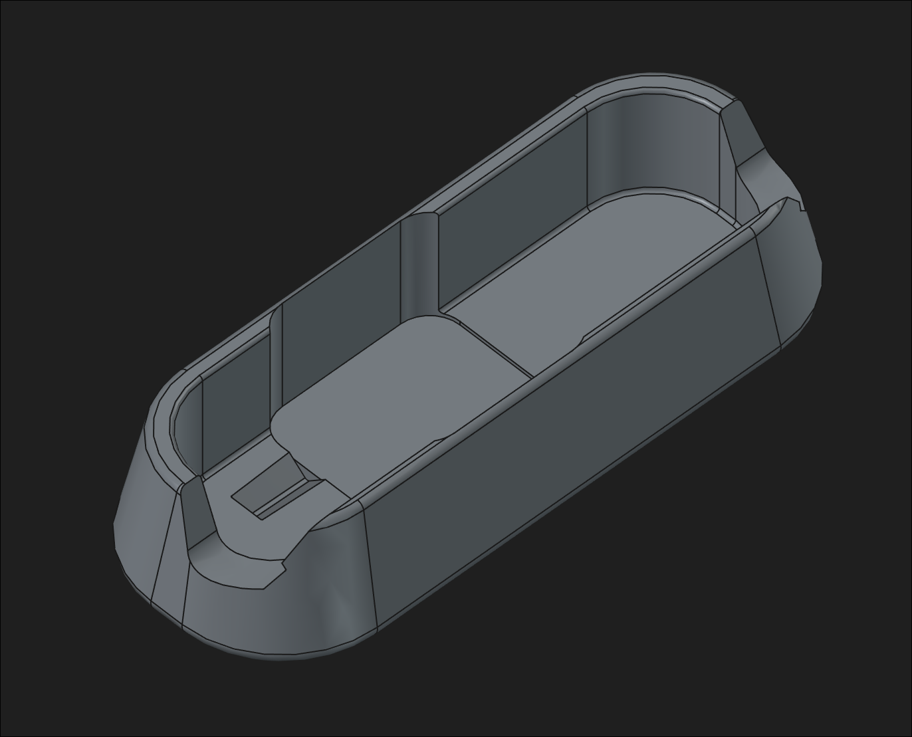 | 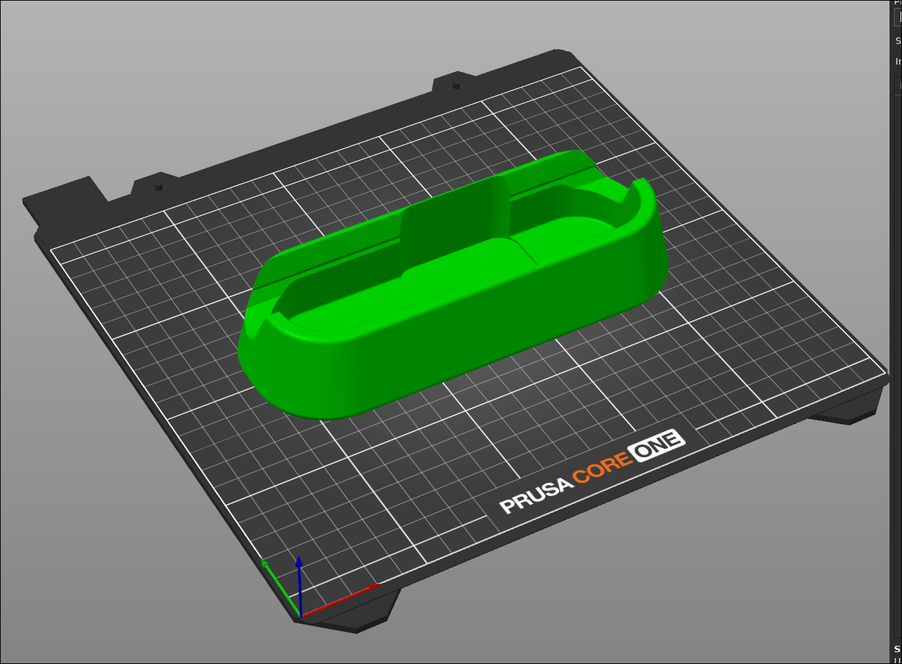 |

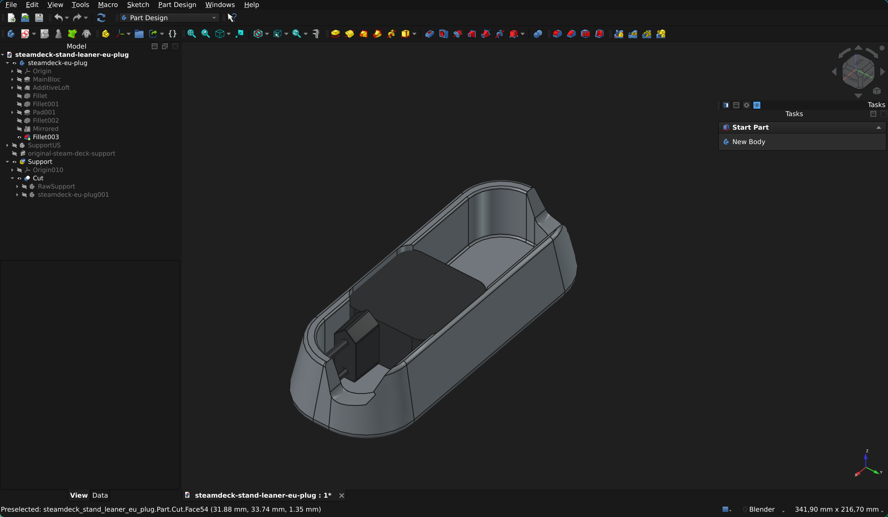

Overall size of the exported part: **178.7 × 68.7 × 35.8 mm** (X × Y × Z).

### Model structure

The final part is the `Support` group, built from:

- `RawSupport`: the stand body.
- `steamdeck-eu-plug001`: the shape of the EU plug adapter.
- `Cut`: the stand body minus the plug adapter, which gives the plug recess.

To re-export, select the `Support` group and use *File → Export…* as 3MF.

## Final print

Printed, loaded with the EU charger and its cable, and used both as a desk
stand and in the carrying case strap.

| | |
|---|---|
| 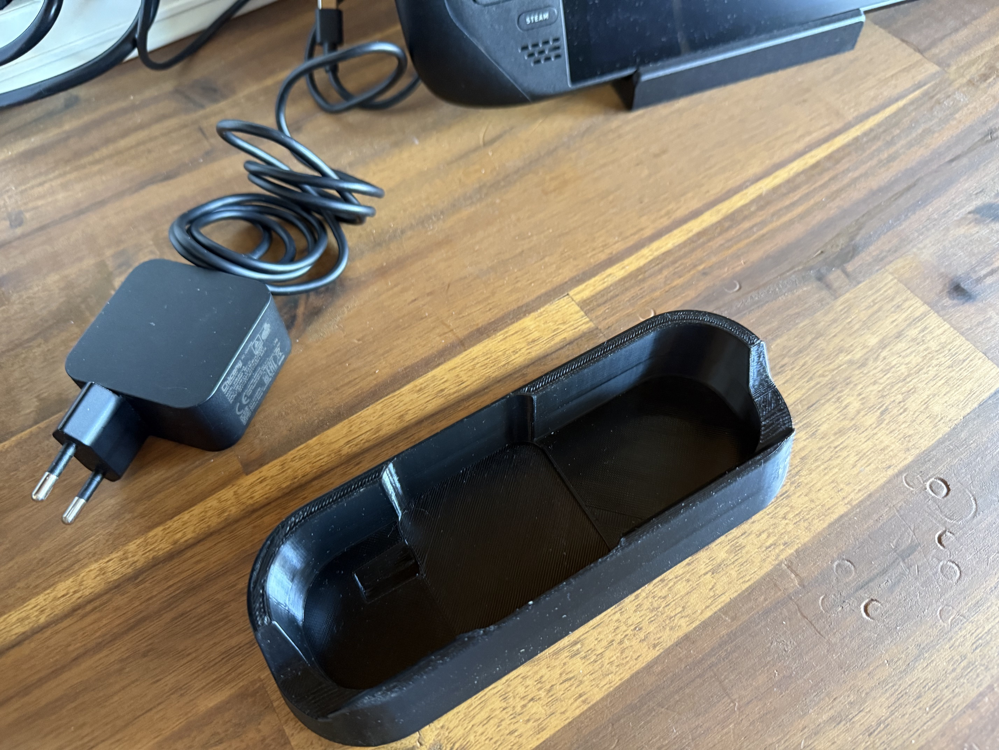 | 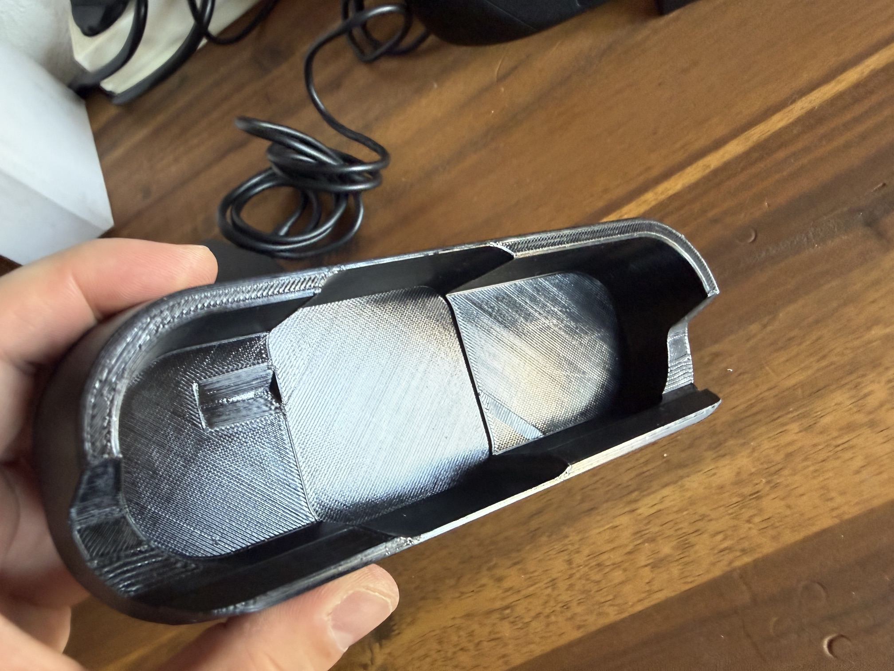 |
| 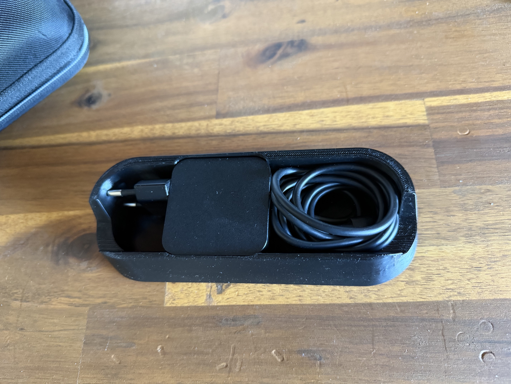 | 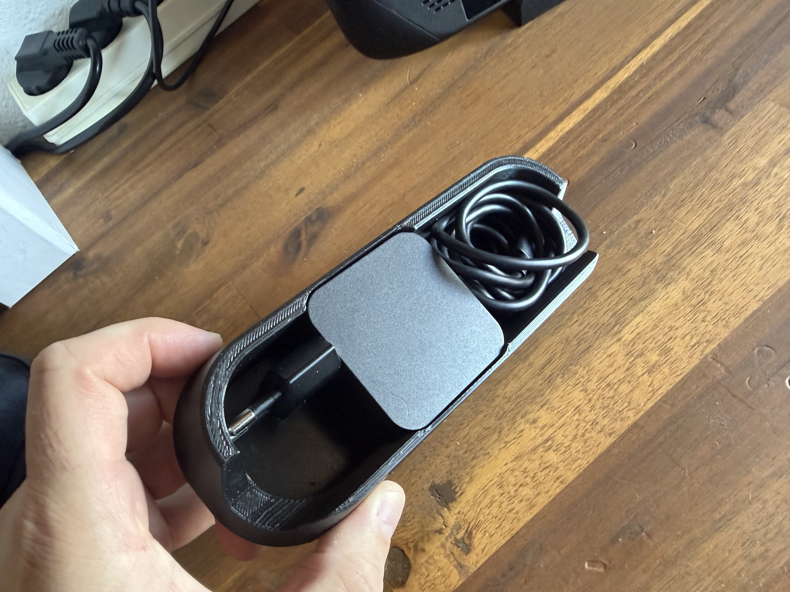 |
| 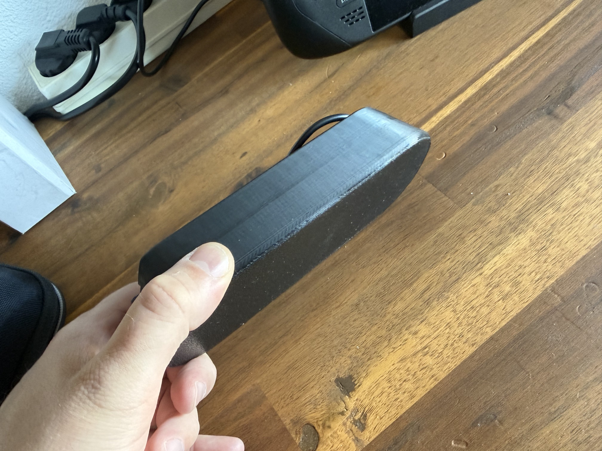 | 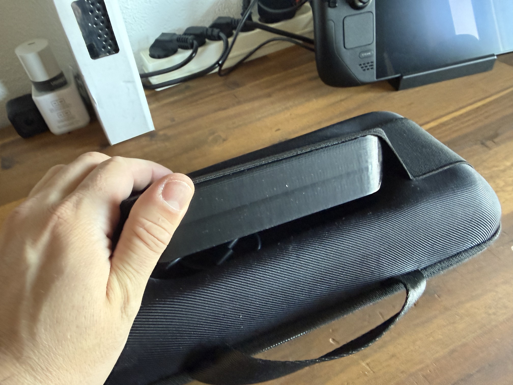 |
| 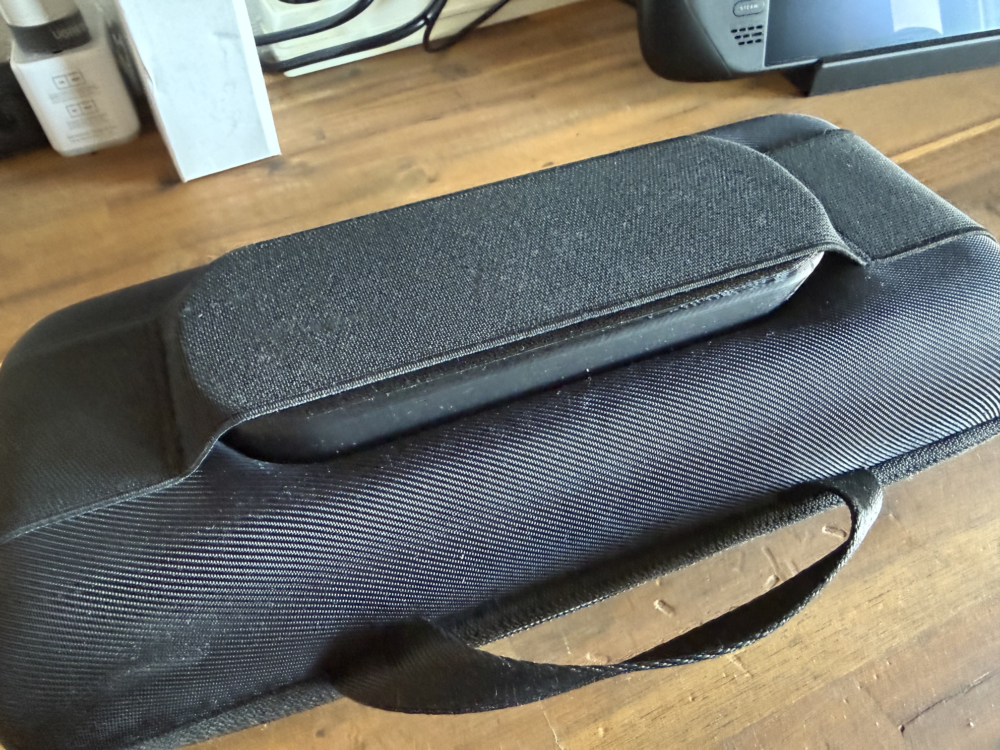 | 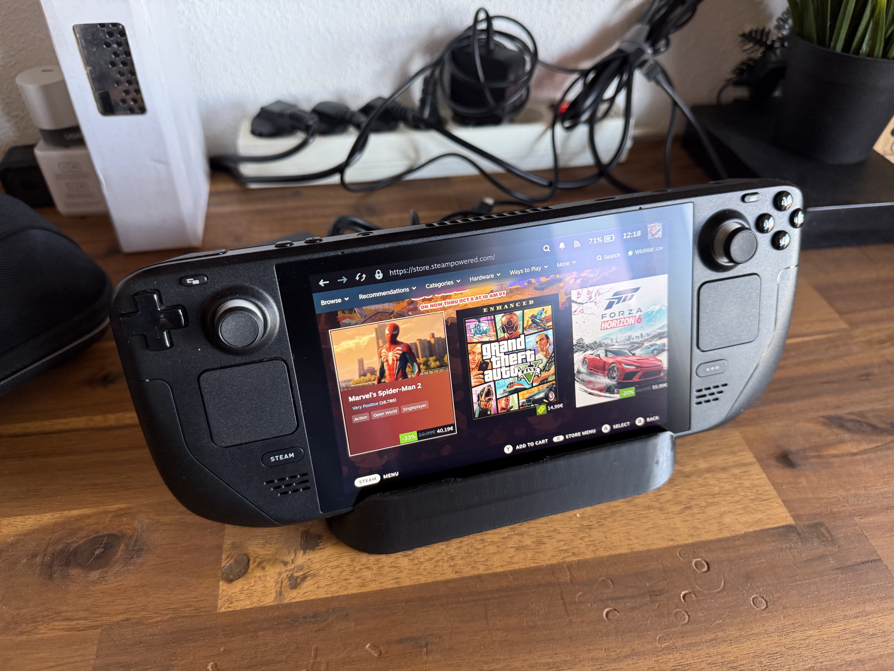 |
| 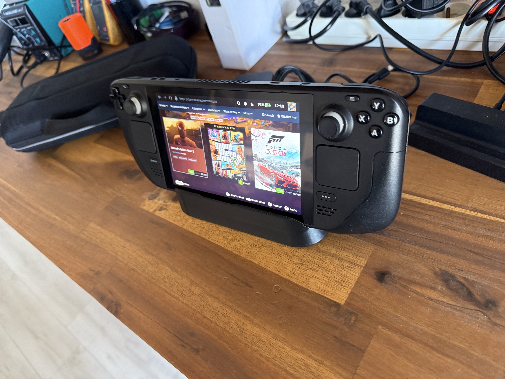 | 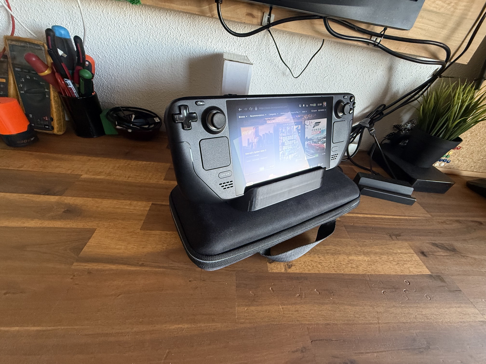 |
| 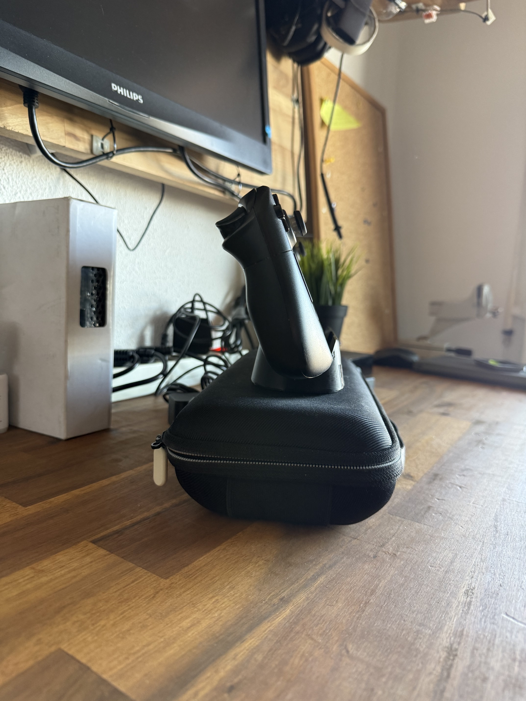 | |

## License

The original model is published under
[CC BY-NC-SA](https://creativecommons.org/licenses/by-nc-sa/4.0/)
(Attribution, NonCommercial, ShareAlike), so this remake is shared under the
same license.

## Status

v1.0.0 — first working print, validated with the EU charger and the carrying
case.
